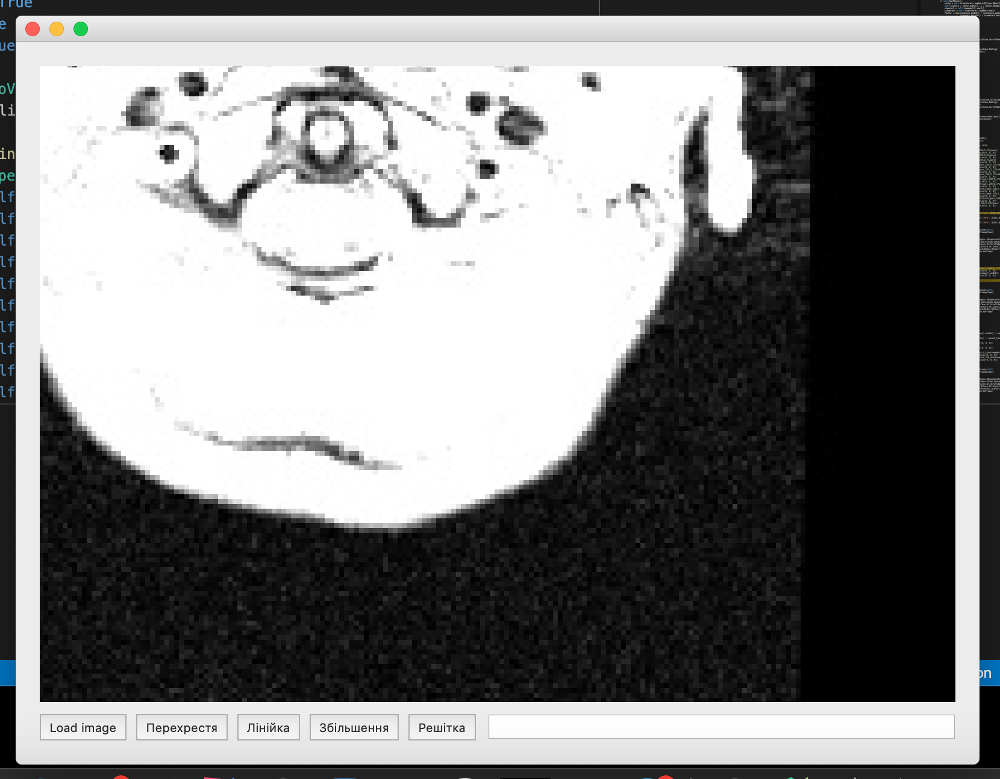
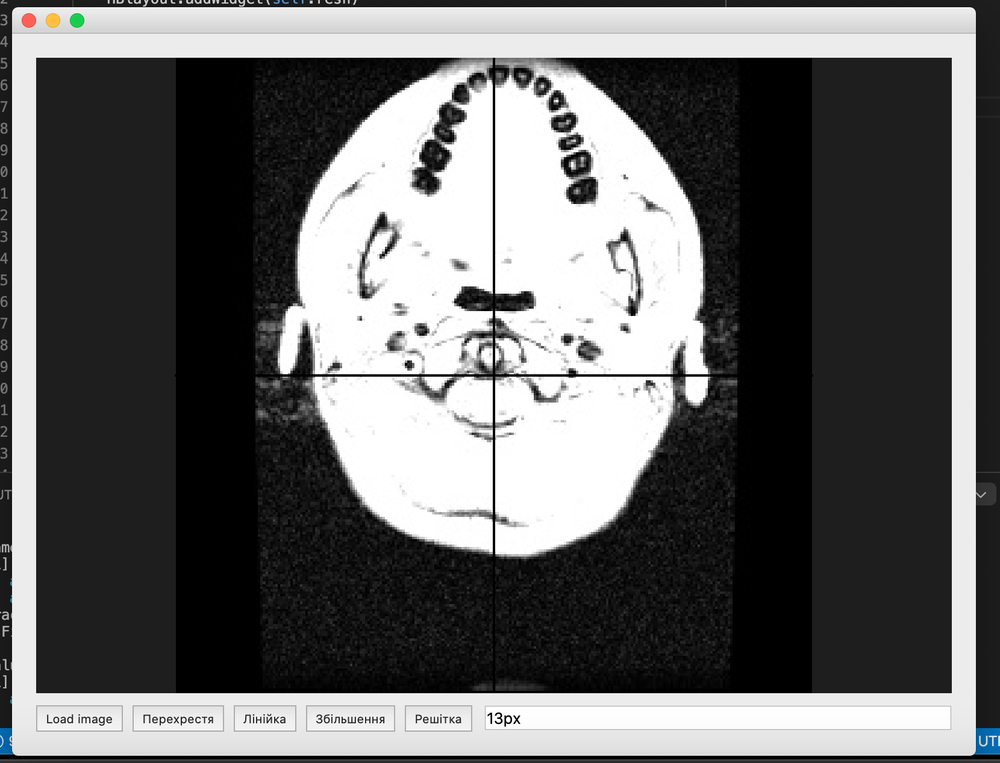

# pyqt_med_dicom

## Qt Program to View and Explore DICOM Images

This application allows you to load and explore DICOM images with various tools such as intersection, ruler, magnification, and lattice.

### Features
- **Load DICOM Images**: Easily load DICOM images to view.
- **Intersection Tool**: Add intersection lines to the image for better analysis.
- **Ruler Tool**: Measure distances on the image using a virtual ruler.
- **Magnification Tool**: Zoom in on specific parts of the image for detailed viewing.
- **Lattice Tool**: Overlay a grid on the image for precise alignment and measurement.

### Installation
1. Clone the repository:
   ```sh
   git clone https://github.com/nnocturnnn/pyqt_med_dicom.git
   ```
2. Navigate to the project directory:
   ```sh
   cd pyqt_med_dicom
   ```
3. Install the required dependencies:
   ```sh
   pip install -r requirements.txt
   ```

### Usage
1. Run the application:
   ```sh
   python main.py
   ```
2. Use the provided buttons to load an image and apply the various tools:
   - **Load Image**: Open a file dialog to select and load a DICOM image.
   - **Intersection (Перехрестя)**: Add intersection lines to the image.
   - **Ruler (Лiнiйка)**: Measure distances on the image.
   - **Magnification (Збiльшення)**: Zoom in on the image.
   - **Lattice (Решiтка)**: Overlay a grid on the image.

### Screenshots



### Contributing
Contributions are welcome! Please feel free to submit a Pull Request.

